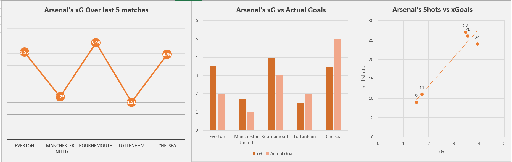
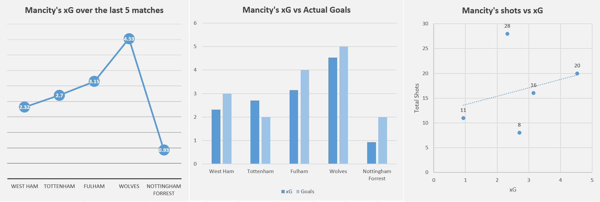
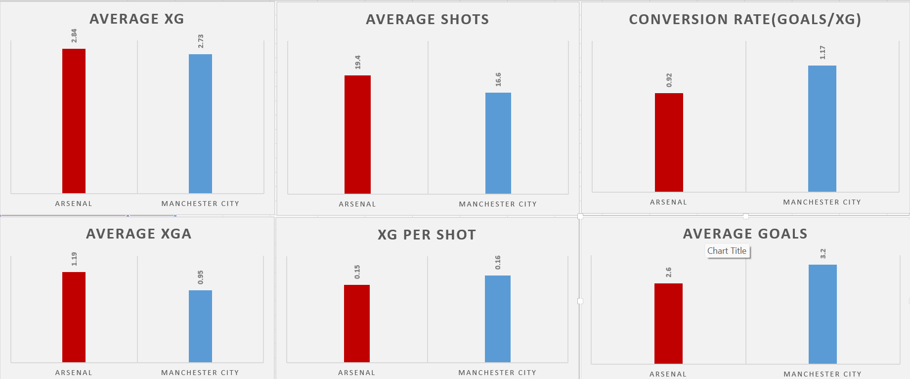

# 🏟️ Premier League Data Analysis: Arsenal vs Manchester City

## 📌 Project Overview

This project dives into match performance data for **Arsenal** and **Manchester City** across five recent Premier League games. By applying key sports analytics metrics—such as **Expected Goals (xG)**, **Expected Goals Against (xGA)**, **actual goals**, and **shots**—this project reveals performance patterns, efficiency levels, and tactical differences between two of the league’s top teams.

## 🧰 Tools Used
- Microsoft Excel
- Data Cleaning
- Descriptive Statistics
- Bar Charts & Line Charts
- Comparative Performance Analysis

## 🔍 Key Insights

- **Attacking Threat:** Arsenal averaged slightly higher xG (2.83) than Manchester City (2.73), reflecting consistent offensive pressure.

- **Defensive Solidity:** Manchester City had a lower xGA (0.95) compared to Arsenal (1.17), showing stronger defensive control.

- **Shot Volume vs. Efficiency:** Arsenal took more shots (19.4 per game) but scored fewer goals (2.6) than City (3.2 goals from 16.6 shots).

- **xG per Shot:** City created slightly higher quality chances per shot (0.16 vs. Arsenal’s 0.15).

- **Conversion Rate:** City’s conversion rate (1.17 Goals/xG) outclassed Arsenal’s (0.42), highlighting their clinical finishing.

## 📈 Visuals
This project includes Excel-based charts for:
- Match-by-match xG and Goals trends
- Match-by-match xG trends
- Shot volume and goal efficiency side-by-side

- Comparison of average metrics

## 🎯 What I Learned
- How to structure and clean raw sports data in Excel
- Key performance metrics in football and how to calculate them
- The power of comparative visualizations for storytelling
- Analytical thinking applied to real-world football data

## 💡 Next Steps
I plan to extend this project by:
- Automating data collection using Python
- Applying regression analysis for predictive insights
- Expanding to more teams and larger datasets

---

**👨‍💻 Author:** Success Iyoha  
**🔗 Connect with me on LinkedIn:** https://www.linkedin.com/in/success-iyoha-878b59238/ 
